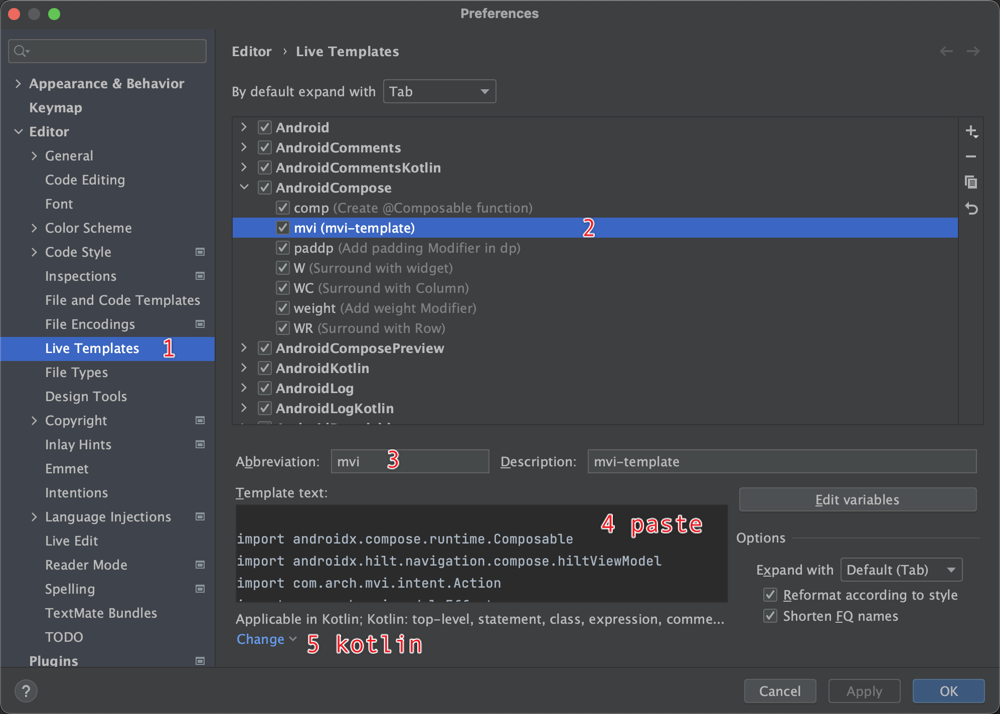

# Best Practices of MVI architecture

## Introduction

Like MVC, MVP or MVVM, MVI is an architectural design pattern that helps us organize our code better to create robust and maintainable applications. It belongs to the same family as Flux or Redux and was first introduced by André Medeiros. The acronym is formed from the contraction of the words "Model", "View" and "UserIntent".


**MVI** stands for **Model-View-Intent**. It is inspired by the Cycle.js front-end framework and advocates a one-way data flow design idea, which is very suitable for data-driven UI display projects:

- **Model**: Different from the Model in other MVVM, the Model of MVI mainly refers to the UI state (State). The content displayed on the current interface is nothing more than a snapshot of the UI state: for example, the data loading process, control position, etc. are all a kind of UI state.
- **View**: Same as View in other MVX, it may be an Activity, Fragment or any UI hosting unit. View in MVI implements interface refresh by subscribing to changes in State.
- **Intent**: This Intent is not the Intent of the Activity. Any user operations are packaged into UserIntent and sent to the Model for data request.


## Google AAC(Android Architecture Components)


## MVI pos&cons

- **pos**
  - All changes in the UI come from State, so you only need to focus on State, making the architecture simpler and easier to debug.
  - Data flows in one direction, making it easy to track and trace status changes
  - State instances are all immutable to ensure thread safety(All attributes of the defined data class must be val)
  - The UI only reflects changes in State, has no additional logic, and can be easily replaced or reused.
- **cons**
  - All operations will eventually be converted into State, so when the State of a complex page is easy to expand
  - The state is unchanged. Whenever the state needs to be updated, a new object must be created to replace the old object, which will cause a certain amount of memory overhead.
  - Some UI changes of event types are not suitable to be described by state, such as popping up a toast or snackbar.

## Jetpack Compose

https://juejin.cn/post/6969382803112722446#heading-9

## architecture diagram


## Compose support, Talk is cheap, show me the code
```kotlin
    val scaffoldState = rememberScaffoldState()
    StateEffectScaffold(
        viewModel = viewModel<ComposeViewModel>(),
        initialState = ComposeState.Loading,
        sideEffect = { sideEffect ->
            when (sideEffect) {
                ComposeEvent.ShowWarring -> {
                    scaffoldState.snackbarHostState.showSnackbar("Snackbar")
                }
                ComposeEvent.Navigation -> {}
            }
        }
    ) { viewModel, state ->
        when (state) {
            ComposeState.Loading -> Loading()
            ComposeState.Empty -> Empty()
            is ComposeState.Chat -> WeChatMock() {
                viewModel.sendAction(ComposeAction.OnActionButtonClick)
            }
        }
    }
```

## MVI Template

please copy the template to clipboard, and go on.


```

import androidx.compose.runtime.Composable
import androidx.hilt.navigation.compose.hiltViewModel
import com.arch.mvi.intent.Action
import com.arch.mvi.model.Effect
import com.arch.mvi.model.State
import com.arch.mvi.view.StateEffectScaffold
import com.arch.mvi.viewmodel.BaseViewModel
import dagger.hilt.android.lifecycle.HiltViewModel
import javax.inject.Inject

/**
 * - new build package and dirs
 *   - contract
 *   - viewmodel
 *   - view
 */

/** - contract */
sealed class $NAME$Action : Action {
    data object LoadData : $NAME$Action()
    data class OnButtonClicked(val id: Int) : $NAME$Action()
}

sealed class $NAME$State : State {
    data object Loading : $NAME$State()
    data object Empty : $NAME$State()
}

sealed class $NAME$Effect : Effect {
    data class ShowToast(val content: String) : $NAME$Effect()
}

/** - viewmodel */
@HiltViewModel
class $NAME$ViewModel @Inject constructor(
//    private val reducer: $NAME$Reducer,
//    private val repository: $NAME$Repository,
//    private val dispatcherProvider: CoroutineDispatcherProvider
) : BaseViewModel<$NAME$Action, $NAME$State, $NAME$Effect>() {

    init {
        sendAction($NAME$Action.LoadData)
    }

    override fun onAction(action: $NAME$Action, currentState: $NAME$State?) {
        when (action) {
            $NAME$Action.LoadData -> {
                /*viewModelScope.launch {
                    withContext(dispatcherProvider.io()) {
                        runCatching { repository.fetchRemoteOrLocalData() }
                    }.onSuccess {
                        emitState(reducer.reduceRemoteOrLocalData())
                    }.onFailure {
                        emitState($NAME$State.Empty)
                    }
                }*/$END$
            }

            is $NAME$Action.OnButtonClicked -> {
                emitEffect { $NAME$Effect.ShowToast("Clicked ${action.id}") }
            }
        }
    }
}

/** - view */
@Composable
fun $NAME$Screen() {
    StateEffectScaffold(
        viewModel = hiltViewModel<$NAME$ViewModel>(),
        sideEffect = { viewModel, sideEffect ->
            when (sideEffect) {
                is $NAME$Effect.ShowToast -> {
                    TODO("ShowToast ${sideEffect.content}")
                }
            }
        }
    ) { viewModel, state ->
        when (state) {
            $NAME$State.Loading -> {
                TODO("Loading")
            }
            $NAME$State.Empty -> {
                TODO("Empty")
            }
        }
    }
}

```
